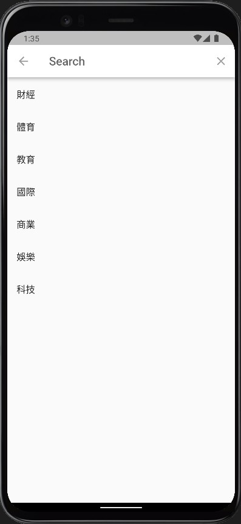

# news_search_app

A new Flutter project.

## Getting Started

This project is a starting point for a Flutter application.

A few resources to get you started if this is your first Flutter project:

- [Lab: Write your first Flutter app](https://docs.flutter.dev/get-started/codelab)
- [Cookbook: Useful Flutter samples](https://docs.flutter.dev/cookbook)

For help getting started with Flutter development, view the
[online documentation](https://docs.flutter.dev/), which offers tutorials,
samples, guidance on mobile development, and a full API reference.

# 正文開始
## >應用程式流程

1. 主頁面可以看到如何使用此應用程式，在左上按下搜尋按鈕就可以開始搜尋。
2. 進入搜尋頁面後可以輸入想尋找的關鍵字或是點擊推薦的關鍵字列表搜尋。
3. 從google news抓取全部新聞標題,如果對標題有興趣可以點擊進入該新聞頁面。
4. 新聞頁面嵌入應用程式，可以直接進行瀏覽動作。

## >應用程式頁面

    <figure style="display: block">
        
         
        <figcaption>圖一</figcaption>
    </figure>
    <figure style="display: block">
        
         
        <figcaption>圖二</figcaption>
    </figure>

 

    <figure style="display: block">
        
         
        <figcaption>圖三</figcaption>
    </figure>
    <figure style="display: block">
        
         
        
圖四

    

## >具體技術

#### 這個應用程式主要是初步介紹使用Dart語言進行爬蟲，而將有用的資料整理成資訊後載入應用程式，而在使用者對該標題有興趣，在將爬蟲所獲得的資訊進而直接加入應用程式進行互動。  
